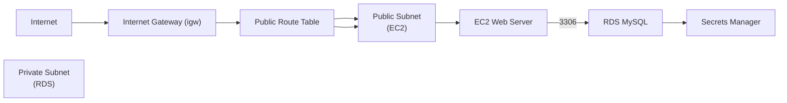

# aws-tf-web-db-stack 🧱☁️

**Transforming a simple VPC + web server + database into a reproducible Terraform demo.** This short, blog-style guide walks you through what this project is, what it creates, how to run it locally, and how to clean everything up safely to avoid surprise bills.

---

## What is this project? 🤔

`aws-tf-web-db-stack` is a compact Terraform example that provisions a small web stack in AWS:

- A VPC with a public subnet and a private subnet
- An EC2 web server in the public subnet
- An RDS MySQL instance in the private subnet
- Secrets Manager storing the generated DB credentials
- Security groups to limit traffic between web and DB layers

It's ideal for learning Terraform, testing connectivity patterns (web → DB), and demonstrating best practices like storing secrets in Secrets Manager.

---

## Architecture (quick view) 🗺️



---

## How this will run in your environment 🔁

1. Clone the repo and change to the project folder (the Terraform code lives in `01-aws-tf-web-db-stack`).
2. Ensure your AWS CLI is configured (profile with permissions to create VPC, EC2, RDS, Secrets Manager).
3. Configure the minimal variables (examples below). The code uses a default `allowed_ssh_cidr` variable — update it to your IP for safe SSH access.

Example environment setup (Linux/macOS; Windows PowerShell equivalent shown inline):

```bash
export AWS_PROFILE=default
export AWS_REGION=us-east-1
export ALLOWED_SSH_CIDR=$(curl -s https://checkip.amazonaws.com)/32  # your IP/CIDR
# Windows PowerShell:
# $env:AWS_PROFILE = 'default'; $env:AWS_REGION = 'us-east-1'
```

Then run:

```bash
cd 01-aws-tf-web-db-stack
terraform init
terraform plan -var "aws_profile=$AWS_PROFILE" -var "aws_region=$AWS_REGION" -var "allowed_ssh_cidr=$ALLOWED_SSH_CIDR" -var "bucket_name=your-bucket-name"
terraform apply -var "aws_profile=$AWS_PROFILE" -var "aws_region=$AWS_REGION" -var "allowed_ssh_cidr=$ALLOWED_SSH_CIDR" -var "bucket_name=your-bucket-name"
```

After apply, view outputs with:

```bash
terraform output
```

---

## Security & safety notes 🔐

- Credentials are stored in **AWS Secrets Manager** (we surface the secret ARN as an output). Do **not** commit secrets or output plaintext passwords to your repo.
- The `allowed_ssh_cidr` variable defaults to `0.0.0.0/0` in this demo — change it to your IP/CIDR before applying.
- The RDS resource is configured with `lifecycle { prevent_destroy = true }` as a safeguard. If you need to delete the RDS for cleanup, remove that block first, `terraform apply` to update state, then run `terraform destroy`.

---

## Useful outputs 🔎

The repository exposes convenient outputs such as:

- `ec2_instance_public_ip` — public IP of the web server
- `rds_endpoint` — RDS endpoint/address
- `rds_secret_arn` — ARN for the Secrets Manager secret holding DB credentials

(See `01-aws-tf-web-db-stack/outputs.tf` for the full list.)

---

## Cleanup — destroy everything to avoid costs 🧹💸

Always destroy resources when you're done to avoid ongoing charges.

Basic destroy command (include the same variables you used to create):

```bash
terraform destroy -var "aws_profile=$AWS_PROFILE" -var "aws_region=$AWS_REGION" -var "allowed_ssh_cidr=$ALLOWED_SSH_CIDR" -var "bucket_name=your-bucket-name"
```

Important: if a resource has `prevent_destroy = true` (RDS in this project), Terraform will refuse to remove it. To remove it safely:

1. Edit `01-aws-tf-web-db-stack/rds.tf` and comment or delete the `lifecycle { prevent_destroy = true }` block.
2. Run `terraform apply` to update the state.
3. Run the `terraform destroy` command above.

If you prefer manual cleanup, remove the RDS instance from the Terraform state with `terraform state rm aws_db_instance.rds_mysql_instance`, then delete it via the AWS Console (not recommended for reproducibility).

Finally, double-check the AWS Billing console for any lingering charges.

---